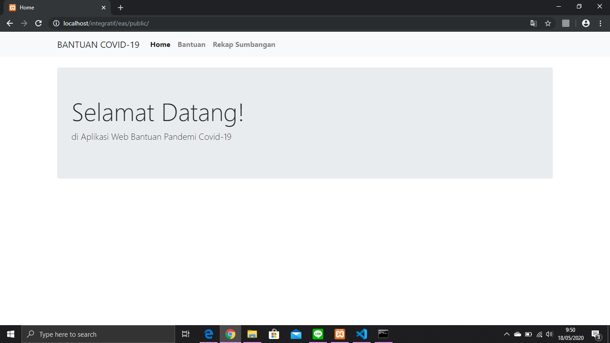
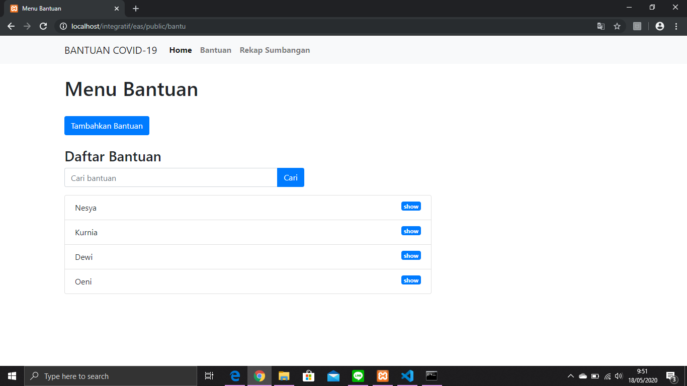
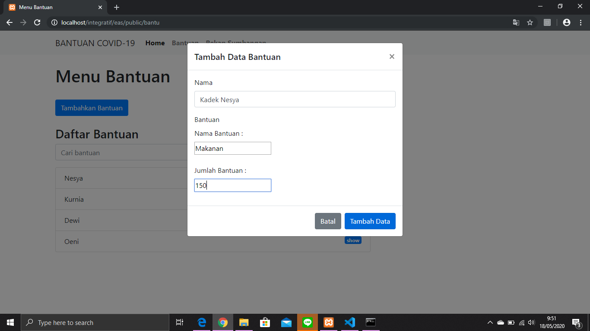
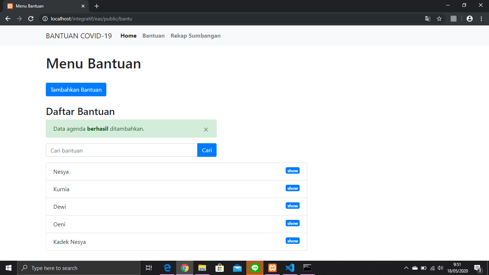
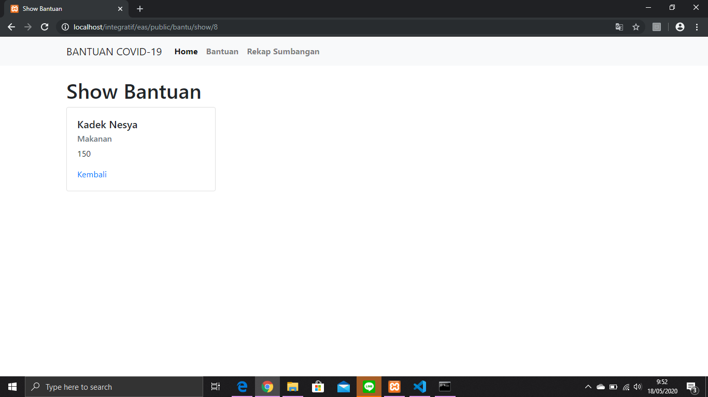
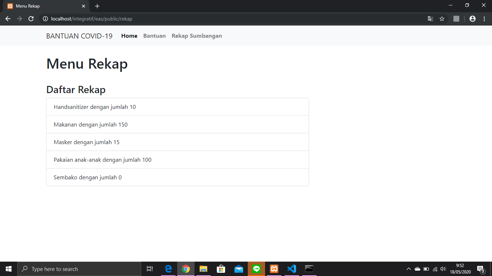

# EAS Pemrograman Integratif
Oleh :
### Kadek Nesya Kurniadewi [05311840000009]

## Penjelasan MVC 
### Models
Model yang saya gunakan pada web yang sudah saya buat ada 2 yaitu **Bantu** dan **Rekap**. 
1. MODEL **BANTU** :
- Memiliki struktur yang teerdiri dari `nama`, `nama_bantuan`, `jenis_bantuan` dan `jumlah_bantuan`
- `nama` yang berguna untuk menyimpan nama dari penyumbang yang dimasukkan saat menginput data pada menu bantuan oleh user
- `nama_bantuan`ini nantinya akan berguna untuk menyimpan bantuan apa saja yang disumbangkan oleh penyumbang saat melakukan input sumbangan pada menu bantuan oleh user
- `jumlah_bantuan`ini akan menyimpan data berupa jumlah sumbangan yang diinput oleh user pada menu bantuan
- Model `Bantu` ini juga terdapat fungsi `findAll()` yang berfungsi untuk mengambil semua data yang ada dan telah dinput oleh user pada tabel penyumbang
- Model `Bantu` juga memiliki fungsi yaitu `findBantuById()` yang berfungsi untuk menyocokkan data sesuai dengan id yang dipilih untuk melakukan show pada menu Bantuan
- Kemudian yang terakhir ada fungsi `insert()` yang digunakan untuk menambahkan data pada menu Bantuan yang nantinya akan diinput ke database yang sudah disiapkan

2. MODEL **REKAP** :
- Pada model `Rekap` ini ada beberapa fungsi yang digunakan yaitu `findAll()`, `findRekapById()`, dan `insert()`
- Fungsi `findAll()` digunakan untuk mengambil data yang ada pada tabel penyumbang
- Fungsi `findRekapById` digunakan untuk memilah data yang sesuai dengan id yang dipilih untuk melakukan show
- Fungsi `insert()` digunakan untuk menginput data yang nantinya akan diinput juga ke database yang sudah disiapkan

### Views
Views yang saya buat ada 3, yaitu `home`, `bantu` dan `rekap`
1. VIEW **HOME**
- View ini hanya menampilkan ucapan Selamat Datang!, dengan tampilan seperti gambar dibawah ini 

2. VIEW  **BANTUAN**
Ini adalah tampilan dari Menu Bantuan

- Pada view bantuan ini kita bisa menginput bantuan dengan mengklik tombol `Tambahkan Bantuan`
- Kemudian melakukan input pada form yang sudah disediakan, kemudian klik tombol `Tambahkan Data` setelah selesai menginput data yang diperlukan

- Jika data berhasil ditambahkan, maka akan ada tulisan seperti dibawah ini. dan data yang kita input tadi sudah terdata dan terlihat pada menu `Bantuan`

- Selain itu, bisa juga untuk melihat detai dari sumbangan yang sudah kita input pada form dengan mengklik tombol `show` pada tabel penyumbang yang ada pada menu Bantuan

3. VIEW **REKAP**
- Pada menu ini akan ditampilkan rekapan sumbangan dan jumlah yang disumbangkan oleh penyumbang berupa tabel `Daftar Rekap`

### Controllers
Pada controllers, saya menggunakan 3 jenis controllers yaitu `HomeController.php`, `BantuController.php`, dan `RekapController.php`
1. **HomeController.php** berfungsi untuk menampilkan halaman awal/home
2. **BantuController.php**
- Pada `BantuController.php` terdapat 2 fungsi yaitu fungsi `index()` dan fungsi `show()`
- Fungsi `index()` berfungsi untuk menampilkan index dari view bantuan
- Fungsi `show()` yang berfungsi untuk menampilkan sumbangan yang diberikan oleh penyumbang sesuai dengan id penyumbang
3. **RekapController.php**
- Pada `RekapController.php` ini terdapat fungsi `index()` yang digunakan untukmenampilkan index dari view rekap sumbangan

## Terima Kasih
